# Textwave Case Study Report
##  Sergio Hortner

## Introduction

This project studies the design of a RAG question-answering system for the TextWave benchmark. The goal of the system is to answer natural language questions by combining a document retrieval stage with a generative language model. Rather than relying only on a model's internal knowledge, the system first searches a local corpus of source articles, selects the most relevant text chunks, and then uses those retrieved chunks as supporting context for answer generation. This design suits the TextWave setting because the benchmark questions are tied to a fixed collection of source documents, and the core problem is grounded generation: the system must retrieve the right evidence and present it to the model in an effcient way that results in a measurable improvement in answer quality over stand-alone generation (that is, a baseline without access to any retrieved corpus context).

The TextWave pipeline follows a modular retrieval-augmented generation architecture. At the extraction layer, ``DocumentProcessing`` is responsible for turning source articles into retrieval units through fixed-length or sentence-based chunking, while ``Embedding`` maps both chunks and questions into a dense vector space, so that retrieval can be performed by comparing a question vector against the chunk vectors. This means that the retriever produces an initial ranking of chunks according to their proximity to the question in embedding space: Brute Force does this by exact comparison against all chunks, while HNSW and LSH provide approximate nearest-neighbor alternatives (with the latter two implementations reused from the IronClad project). On top of retrieval, the pipeline applies a reranker layer, which reorders the candidate chunks returned by the previous layer using different candidate reranking schemes. At the generation and evaluation layer, local Ollama-based models are invoked through an OpenAI-compatible wrapper, and answer quality is measured with the project's ``Matching`` module, which provides both Exact Match and Transformer Match scoring. This modular organization is important because it allows the report to isolate one design choice at a time: 

i) chunking determines the retrieval units, 

ii) embedding and indexing determine a first-stage ranking, 

iii) the reranking routine refines that ranking, 

iv) and the generator then answers from the final selected context.

The analysis uses two main data sources. The first is the benchmark question file, ``question.tsv``, which contains the evaluation questions, their gold answers, difficulty labels, and the source article references used in retrieval-based experiments. The second is the local corpus of 150 cleaned article files stored as ``.clean`` documents, which serve as the retrieval source collection. The connection between the two is that each question in `question.tsv` is associated with a source article through its `ArticleFile` field, and that article should correspond to one of the cleaned corpus files. This makes it possible to evaluate retrieval systematically: for a given question, a retrieved chunk is treated as relevant if it comes from the article indicated in the question file. In this way, the question set defines both the evaluation targets and the expected link to the document collection, while the cleaned corpus provides the actual textual evidence from which chunks are built, embedded, indexed, retrieved, and later passed to the generator. In the retrieval-augmented experiments, a preprocessed subset of `question.tsv` is used, keeping only rows with valid entries for question, gold answer, and retrievable source article, since all three are required for end-to-end RAG evaluation.

The report is organized as a sequence of linked design questions that progressively build the final TextWave system:

* **Section 1** studies the retrieval side of the architecture, beginning with a comparative study of different chunking strategies and the subsequent selection of the optimal one. Then, we compare the retrieval performance across the indexing methods Brute Force, HNSW, and LSH. The aim is to determine which retrieval units and which index structure provide the best balance between retrieval quality and efficiency. 

* **Section 2** evaluates the two available Ollama generators ``phi3:mini`` and ``qwen2.5:1.5b`` in a no-context setting  (meaning that each model is asked to answer the benchmark questions from the question text alone, without access to any retrieved chunks). This establishes a stand-alone baseline for generation before retrieval is introduced. The purpose of this section is to measure how much the models can answer from their internal knowledge alone, so that later improvements in the RAG pipeline can be attributed more clearly to the addition of retrieved evidence rather than to the generator model itself. The section compares the two models overall and by question difficulty, using Exact Match and Transformer Match as evaluation metrics, in order to identify the stronger generator to carry forward into the retrieval-augmented experiments.

* **Section 3** combines the retrieval backbone selected in Section 1 with the generator models studied in Section 2 to form a no-reranker RAG pipeline. In this setup, the system first retrieves a small set of candidate chunks from the corpus and passes them directly to the generator as context, without applying any subsequent reranking. This section therefore provides the first end-to-end grounded question-answering experiment in the report. Its purpose is twofold: i) to measure the effect of retrieval augmentation itself by comparing this pipeline against the stand-alone, no-context baseline; and ii) to identify which generator remains stronger once both models are supplied with retrieved evidence. Methodologically, omitting the reranker at this stage is important because it isolates the performance of retrieval augmentation alone.

* **Section 4** adds a reranking stage to the no-reranker pipeline from Section 3 and compares several alternative reranking strategies: lexical rerankers, neural rerankers, hybrid rerankers, and sequential rerankers. Conceptually, reranking is introduced because the first-stage retriever is designed to recover a broad set of plausible candidates efficiently, but not necessarily to place the most useful chunks for answer generation at the very top of the final context list (which is what is passed to the generator as context). A reranker therefore reorders the retrieved candidate pool so that the chunks passed to the generator are more tightly aligned with the question. This section investigates whether the reranking refinement improves end-to-end answer quality, and if so, which reranking strategy provides the best balance between effectiveness and computational cost. By keeping the retrieval backbone fixed and varying only the reranker, the section isolates the specific contribution of reranking and selects the strongest overall end-to-end architecture to carry forward.

* **Section 5** focuses on the number of retrieved chunks passed to the generator `m`, and investigating how answer quality changes as that parameter varies. Once the overall architecture has been selected, this becomes a parameter configuration question rather than an architecture selection question: the issue is no longer which retriever, reranker, or generator to use, but how much retrieved evidence the chosen system should actually present to the language model at inference time. This section therefore analyzes the tradeoff between too little context and too much context. If `m` is too small, the model may not receive enough evidence to answer correctly; if ``m`` is too large, the prompt may become slower, noisier, and more redundant, especially when nearby chunks overlap or repeat similar information. The section evaluates a range of ``m`` values under the same fixed retrieval and reranking backbone, and reports how both answer quality and latency change as more chunks are included. 

A central idea throughout the report is that retrieval quality must be interpreted at more than one level. A system may retrieve a chunk from the correct article without surfacing the specific passage that actually supports answer generation, and a model may receive retrieved context without using it effectively if the evidence is poorly ordered or excessively redundant. For this reason, the report evaluates systems using complementary metrics. On the retrieval side, measures such as ``Hit@k`` (whether at least one relevant chunk appears within the top-k retrieved results), ``MRR`` (Mean Reciprocal Rank, which measures how early the first relevant chunk appears in the ranking), ``nDCG@10`` (Normalized Discounted Cumulative Gain at 10, evaluates how well the top ten retrieved results are ordered), and ``AnswerRecall@k`` (whether at least one of the top-k retrieved chunks actually contains the answer) distinguish between finding the correct source article and retrieving genuinely answer-bearing evidence. 

For evaluating generation, we used the metrics ``Exact Match`` and ``Transformer Match``. Exact Match assesses whether the generated answer matches the gold answer exactly (up to the evaluator's normalization procedure). and therefore captures strict lexical correctness. Transformer Match assesses whether the generated answer is semantically correct even if phrased differently, by using a transformer-based equivalence model that compares the generated answer and the gold answer using the question as context, capturing therefore semantic equivalence and paraphrasing. Using both metrics is important because they evaluate complementary aspects of QA quality: the first is intentionally strict about answer form, while the second is more suitable for free-form generation, where a correct answer may not reproduce the reference wording exactly.

## 1. Chunking Strategy Selection

The first design question for the TextWave system concerns the retrieval side of the pipeline. Before comparing generators, we must determine which chunking strategy produces the most useful retrieval units, and which index retrieves those units most effectively. These question are relevant because the generator only sees the context that retrieval passes to it: if the retriever surfaces the wrong article, the later stages have little chance of recovering, whereas if it finds the correct article but ranks weak or incomplete chunks too highly, the generator may still fail even though the source document is technically present in the corpus. Essentially, we are deciding what kind of context the later RAG pipeline will actually receive.

The analysis is conducted on the question set in ``question.tsv`` and the full local corpus of 150 preprocessed ``.clean`` article files. These cleaned files serve as the retrieval source documents for the system. Importantly, the retriever does not search only within the article linked to a given question: instead, all 150 files are first chunked into a single shared retrieval collection, and each question is run against that full collection. This is what makes the task a genuine retrieval problem: the system must identify the correct source article from the whole corpus, rather than from a question-specific subset. 

Having a cleaned corpus of files is important because it gives the pipeline standardized text for chunking, embedding, and reliable matching between corpus filenames and the ``ArticleFile`` references in the question set. For each question, a retrieved chunk is treated as relevant if it comes from the file identified in the question's `ArticleFile` field. Relevance is thus defined at the article level: a chunk is counted as correct because it originates from the correct source document, even if it is not itself the exact answer-bearing passage.

This is different from a direct answer-span evaluation. Under an answer-span definition, a chunk would be counted as relevant only if it actually contains the gold answer text, or overlaps closely with the passage that supports the answer. Here, by contrast, the retrieval question is broader: did the system retrieve chunks from the correct article at all, and how highly were those chunks ranked?

Retrieval is evaluated through two complementary experiments, and this two-part evaluation is applied both to the chunking selection analysis and to the index selection analysis. The first experiment investigates whether the system can recover the correct source article for a question and place chunks from that article near the top of the ranked retrieval results. The second experiment asks a stricter, more downstream-oriented question: among the retrieved chunks, did the system recover one that actually contains the answer (and is therefore valuable for answer generation)? Note that our methodology isolates one design choice at a time. In the first retrieval experiment, chunking is compared under exact brute-force search so that differences come from the retrieval units themselves rather than from approximation effects. Once an optimal chunking strategy is selected, the chunking strategy is held fixed for the second retrieval experiment, which consists in varying the indexing method across Brute Force, HNSW, and LSH. The purpose is to investigate whether a faster search structure can preserve the quality of exact retrieval.

Recall that a retriever ranks chunks by comparing the query embedding with chunk embeddings in a shared embedding space and estimating which chunks are closest under its search procedure. In our pipeline, both questions and chunks are embedded with the same sentence-transformer model, ``all-MiniLM-L6-v2``, so retrieval amounts to finding which chunk vectors lie closest to the query vector in that common representation space. Brute Force does this through exact distance computation against all chunks, HNSW approximates nearest-neighbor search in that same embedding space through a graph-based structure, and LSH uses hash-based approximation to group embeddings into buckets rather than relying on the same direct exhaustive distance comparison.

Several metrics are used across this section to investigate different aspects of retrieval. They can be grouped into two broad families: i) article-level retrieval metrics, which ask whether the system is retrieving chunks from the correct source document and ranking them well, and ii) answer-bearing retrieval metrics, which ask whether the retrieved chunks are likely to be directly useful for answer generation.

**Article-level retrieval metrics**

These metrics treat a chunk as relevant if it comes from the source article named in the question’s `ArticleFile` field.

- **Hit@k** measures whether at least one relevant chunk appears within the top-k retrieved results.

- **Recall@k** measures the proportion of all relevant chunks that appear within the top-k retrieved results. This is useful for understanding how completely the retriever recovers the relevant evidence associated with a question. In our setup, however, this metric should be interpreted with care, because the number of relevant chunks depends on the chunking strategy: articles split into more chunks automatically create more possible relevant items.

- **Precision@k** measures the proportion of the top-k retrieved chunks that are relevant. A higher ``Precision@k`` means that the retriever is wasting fewer top-ranked positions on irrelevant chunks.

- **MAP@k** (Mean Average Precision at k) evaluates how well relevant chunks are distributed throughout the top-k ranking. It rewards systems that retrieve multiple relevant chunks and rank them consistently early, rather than retrieving only one relevant hit near the top and then filling the remaining ranks with noise.

- **MRR** (Mean Reciprocal Rank) measures how early the first relevant chunk appears. For a single query, it is the reciprocal of the rank of the first relevant result, so a relevant chunk at rank 1 gives a score of 1, at rank 2 a score of 1/2, at rank 3 a score of 1/3, and so on. Averaged over queries, MRR therefore emphasizes systems that place a useful result as close to the top of the list as possible.

- **nDCG@10** (Normalized Discounted Cumulative Gain at 10) evaluates the overall quality of the top-10 ranking, not just whether one relevant chunk appears somewhere in it. For a query with relevance labels $rel_i$ at ranks $i=1,\dots,10$, the discounted cumulative gain is

  $$
  DCG@10=\sum_{i=1}^{10}\frac{2^{rel_i}-1}{\log_2(i+1)}.
  $$

  This quantity gives positive credit to relevant chunks, but discounts them logarithmically as they appear lower in the ranking, so relevant chunks near rank 1 contribute more than relevant chunks near rank 10. The score is then normalized by $IDCG@10$, the ideal discounted cumulative gain at 10, which is the maximum possible value for that same query if all relevant items were ranked in the best possible order. In our setting, relevance is defined at the article level, so the relevant items for a query are exactly the chunks that come from the source article named in that question's `ArticleFile` field. Once a chunking strategy is fixed, we therefore know how many relevant chunks exist for that query. If that number is $R_q$, then the ideal ranking places $\min(R_q,10)$ relevant chunks in the first positions, and with binary relevance this gives

   $$
   IDCG@10=\sum_{i=1}^{\min(R_q,10)} \frac{1}{\log_2(i+1)}.
   $$

   This means that $IDCG@10$ is not one global constant for the whole experiment: it is computed separately for each query, based on how many chunks from the correct article exist under the chosen chunking configuration.
In our setting, ``nDCG@10`` rewards systems that place multiple relevant chunks early in the ranking. It is therefore a stronger measure of top-list organization than ``Hit@k`` or ``MRR`` alone.

- **ANNRecall@k** is used when approximate nearest-neighbor methods such as HNSW or LSH are compared against an exact baseline. It measures how closely the approximate retriever reproduces the top-k neighbors returned by exact search. This helps separate two different issues: whether an approximate index is faithful to the exact embedding-space neighborhood, and whether that neighborhood is itself useful for downstream retrieval quality.

**Answer-bearing retrieval metrics**

These metrics are stricter: they ask not only whether the system retrieves the correct article, but whether it retrieves chunks that are directly useful for answering the question.

- **AnswerRecall@k** asks whether at least one of the top-k retrieved chunks actually contains the gold answer string. This is more demanding than article-level relevance, because a retriever may successfully surface the correct article while still failing to retrieve the specific passage that would help the generator answer correctly. For that reason, ``AnswerRecall@k`` serves as a bridge between retrieval quality and generation readiness.

### Chunking strategy comparison

Chunking is the process of splitting each source document into smaller retrieval units before embedding and indexing. It is introduced because the system cannot effectively search, rank, and pass forward entire articles as single undifferentiated blocks. We investigate the effect of chunking, and whether the corpus should be chunked using fixed-length windows or sentence-based windows. This is a central design choice because chunking defines the units that are embedded, indexed, retrieved, and eventually passed to the generator. Very small chunks may rank well because they isolate narrow topical signals, but they may fail to contain enough answer-bearing context. Larger chunks may capture the answer more often, but they may blur the signal needed for very early ranking.

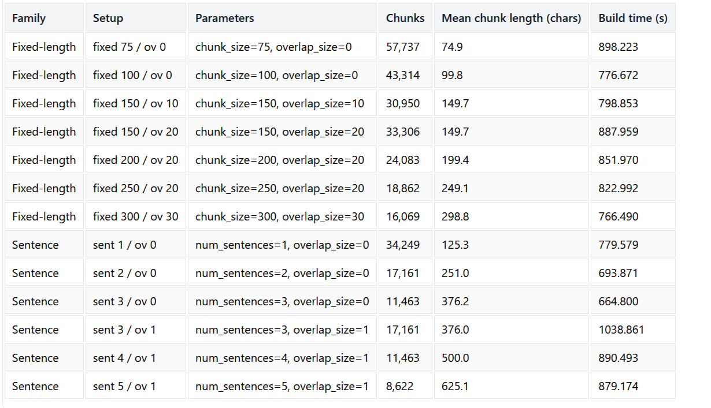

**Table 1.1.** Chunking configurations.

We initiated the ``task1`` notebook with a comparison of several fixed-length settings and sentence-based settings under the same brute-force retrieval backend (detailed in Table 1.1). If chunking is ranked only by metrics measuring only article-level and early-retrieval, the strongest configuration is sentence chunking with 1 sentence and 0 overlap. In the attached notebook, this setting achieves the highest scores for the relevant metrics: ``Hit@1 = 0.838249``, ``Hit@5 = 0.894386``, ``MRR = 0.861437``, and ``nDCG@10 = 0.667397`` (see Table 1.2). In practice, this means that for about 84% of questions, the very first retrieved chunk already comes from the correct source article, and for nearly 90% of questions, at least one correct-article chunk appears within the top five retrieved chunks. However, its answer-bearing metrics (Table 1.3) are much weaker, with ``AnswerRecall@5 = 0.320238`` and ``AnswerRecall@10 = 0.354762``. Under this chunking strategy, the retriever often finds the right article early, but less often surfaces a chunk that actually contains the answer string.

Looking across the sentence-based chunking strategies, there is a consistent broader pattern. As the number of sentences per chunk increases, early article-level ranking gradually weakens, while answer-bearing recall improves. Moving from 1 sentence with no overlap to 2 sentences with no overlap lowers ``Hit@1`` from 0.838249 to 0.804948 and ``MRR`` from 0.861437 to 0.833325, but raises ``AnswerRecall@10`` from 0.354762 to 0.401190. The same tendency continues for larger windows. With 4 sentences and overlap 1, ``AnswerRecall@10`` rises to 0.427381, and with 5 sentences and overlap 1 it reaches the highest value in the sentence chunking family, 0.433333. But these gains come with weaker early ranking, since ``Hit@1`` falls to 0.749762 and 0.758325 respectively, and ``MRR`` falls to 0.796955 and 0.798389. Larger chunks therefore preserve answer evidence better, but they also blur the narrower topical signal that helps the retriever rank the correct article very early.

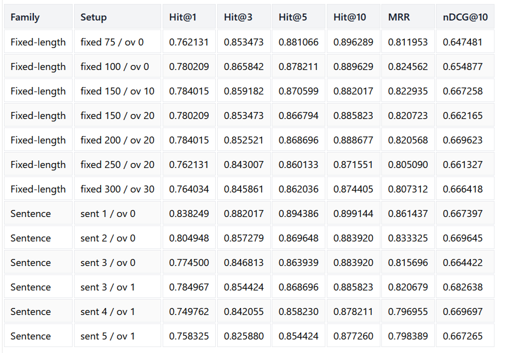

**Table 1.2.** Article-level retrieval quality.

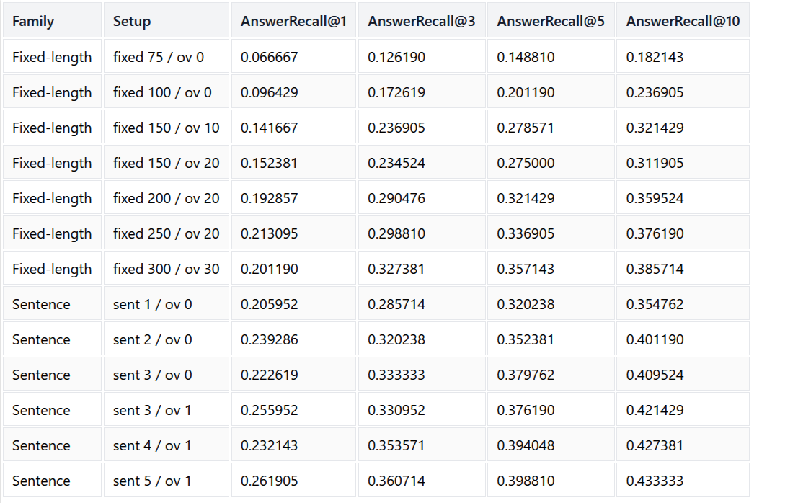

**Table 1.3.** Answer-bearing retrieval quality.

Overlap also matters. The clearest comparison is between the two 3-sentence settings: 3 sentences with no overlap and 3 sentences with overlap 1. Keeping the chunk width fixed at 3 sentences but adding overlap 1 improves nearly all of the key ranking metrics relative to 3 sentences with no overlap: ``Hit@1`` rises to 0.784967, ``Hit@5`` to 0.868696, ``MRR`` to 0.820679, ``nDCG@10`` to 0.682638, and ``AnswerRecall@10`` to 0.421429. ``AnswerRecall@5`` changes only slightly, from 0.379762 to 0.376190. This suggests that overlap helps recover answer evidence that would otherwise be split across chunk boundaries, improving the overall quality of the retrieved set even when the gain at very small k is modest.

The fixed-length family shows the same overall tradeoff, but at a weaker level. As fixed-length chunks become larger and more overlapping, ``AnswerRecall@10`` improves steadily from 0.182143 for size 75 with no overlap to 0.385714 for size 300 with overlap 30, while the early-ranking metrics peak earlier and then flatten or decline. The best fixed-length configuration on the article-level criteria is size 100 with no overlap, with ``Hit@5 = 0.889629`` and ``MRR = 0.824562``, but even that remains weaker than the strongest sentence-based settings on both early article retrieval and answer-bearing recall. The sentence family is therefore preferable generally: it offers better top-end performance on the article-level metrics, higher answer-bearing recall, and a more interpretable control over the balance between ranking sharpness and contextual completeness.

The additional ``Recall@k``, ``Precision@k``, and ``MAP@k`` results support the same interpretation (see Table 1.4). ``Recall@k`` generally rises as chunks become larger, both in the sentence-based and fixed-length families, because having larger chunks make it easier to recover more chunks from the correct article within the top-k set. In the sentence family, ``Recall@10`` increases from 0.034160 for 1 sentence with no overlap to 0.133691 for 5 sentences with overlap 1, while in the fixed-length family it rises from 0.020956 for size 75 with no overlap to 0.075682 for size 300 with overlap 30. ``Precision@k`` and ``MAP@k``, however, show that the best-balanced top-k rankings are not produced by the largest chunks. Within the sentence family, the 3-sentence, overlap-1 configuration gives the strongest overall mid-ranked quality, with ``Precision@3 = 0.732636``, ``MAP@3 = 0.714346``, ``Precision@5 = 0.703140``, ``MAP@5 = 0.675373``, ``Precision@10 = 0.656137``, and ``MAP@10 = 0.618312``, all stronger than the 1-sentence setting and generally stronger than the larger 4- and 5-sentence windows. The fixed-length family shows the same broad pattern but at a lower level: larger windows improve ``Recall@k`` and somewhat improve ``MAP@k`` relative to the smallest fixed chunks, but they do not match the best sentence-based configurations on the cleanliness and ordering of the retrieved set. Our conclusion is that very small chunks maximize first-hit sharpness, very large chunks improve coverage.

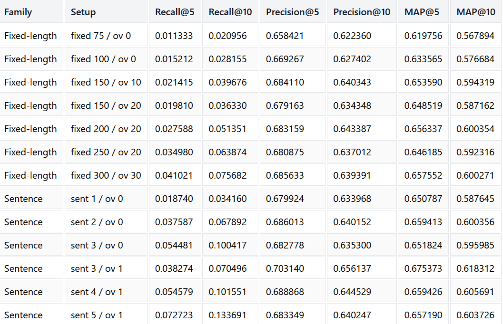

**Table 1.4.** Recall/Precision/MPA values.

This broader pattern explains why sentence chunking with 3 sentences and overlap 1 is the best balance over the displayed metrics. The balance involves three objectives: strong early article-level ranking, strong answer-bearing retrieval, and good overall ordering of the top retrieved set. The 1-sentence configuration is best only if the priority is to maximize early article hits. The 4 and 5 sentence overlapping settings are best only if answer containment is treated as the dominant objective. By contrast, the 3-sentence, overlap-1 configuration sits between these extremes: it preserves much more answer-bearing context than the 1-sentence setup (with ``AnswerRecall@10 = 0.421429``) while keeping article-level retrieval competitive (``Hit@5 = 0.868696`` and ``MRR = 0.820679``). It also has the strongest ``nDCG@10`` in the sentence family (``0.682638``) which indicates the best overall organization of the top-10 retrieved set. For the later RAG pipeline, this is the most balanced choice: it gives up some rank sharpness, but gains substantially in the likelihood that the retrieved context is actually useful for generation.

The latency metrics reinforce the same conclusion (see Table 1.5). Mean query time measures average retrieval latency per question, p95 query time measures tail latency (how bad retrieval is for the slower queries), and throughput measures how many queries can be processed per second. Across both chunking families, these operational metrics improve as the number of chunks decreases. Very fragmented configurations are the slowest: fixed-length size 75 with no overlap has mean query time 0.008612 seconds, p95 query time 0.012361 seconds, and throughput 116.12 queries per second, while sentence chunking with 1 sentence and no overlap reaches 0.005896 seconds, 0.008815 seconds, and 169.60 queries per second. Larger chunkers are faster because they produce smaller indexes. At the other extreme, sentence chunking with 5 sentences and overlap 1 is the fastest sentence-based option, with mean query time 0.002022 seconds, p95 query time 0.003242 seconds, and throughput 494.62 queries per second. Sentence chunking with 3 sentences and overlap 1 is not the fastest configuration, but it remains operationally attractive, with better values of mean query time, p95 query time and queries per second than the 1-sentence baseline. This is a relevatn point because the preferred strategy should not only retrieve better evidence, but should do so without imposing unnecessary higher retrieval cost.

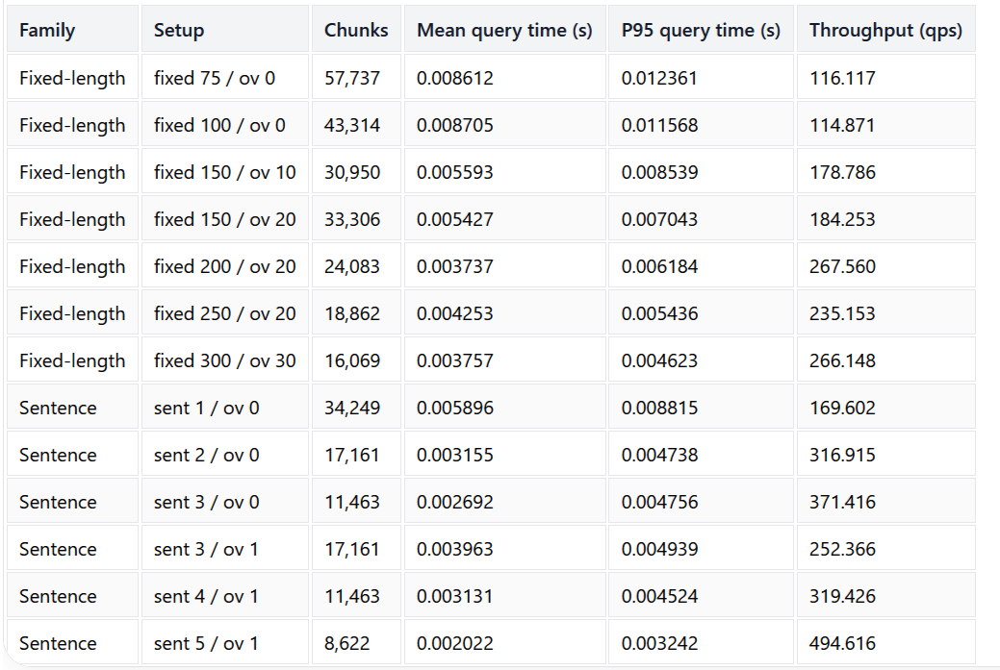

**Table 1.5.** Latency metrics.

### Methodological limitations of the chunking evaluation

Our chunking evaluation should be interpreted with caution because the relevance definition wwwas intentionally simplified. A chunk is counted as relevant whenever it comes from the correct source file, even if that particular chunk does not contain the answer span. This makes the setup generous in one sense, because a semantically weak chunk from the correct article is still counted as correct. At the same time, it can be harsh in another sense, because each source article often contributes many chunks, which makes recall-style metrics small even when a chunk from the correct article is found early.

There are several implications of this choice. First, smaller chunks create more positives per question, so direct comparisons across chunking strategies are not perfectly fair. Second, overlap can create near-duplicate chunks, which may make some configurations look stronger than they really are, because a retriever can receive credit for surfacing several highly similar chunks that all come from essentially the same local passage rather than from genuinely diverse useful evidence. Third, a strong article-level hit rate does not guarantee that the top-ranked context is answer-bearing enough for a generator: the system may retrieve the correct article early, but still fail to surface the specific passage that states or supports the answer. This is why the additional `AnswerRecall@k` metric is valuable and why our conclusions for the best  chunking strategy should be taken as conditional on the evaluation setup, rather than as absolute claims that one chunking method is universally best in every downstream scenario.

### Index comparison

Once our chunking strategy is fixed, the next question is how the chunk embeddings should be indexed for retrieval. This is where the architectural tradeoff between exactness and efficiency becomes explicit. Brute Force provides exact retrieval and therefore acts as the reference baseline. HNSW and LSH are approximate nearest-neighbor methods that aim to reduce query time, but they may do so at the cost of a lower retrieval quality. 

In our notebook, this comparison is carried out after fixing the chunking strategy to sentence chunking with 3 sentences and overlap 1, so the only changing component is the indexing backend. Using that sentence-based chunking configuration, the notebook compares Brute Force, HNSW, and LSH under the same embedding space. Brute Force with euclidean distance again produces the strongest absolute retrieval quality in the comparison: ``Hit@1 = 0.784967``, ``Hit@5 = 0.868696``, ``MRR = 0.820679``, ``nDCG@10 = 0.682638``, and ``AnswerRecall@10 = 0.421429``. By construction, it also has perfect ANN recall relative to itself. Its build time is only 0.010413 seconds, index size is about 25.14 MB, and mean query time remains modest at 0.003212 seconds, with p95 latency 0.003904 seconds and throughput about 311.31 queries per second.

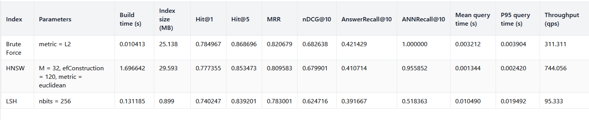

**Table 1.6.** Index comparison under the selected chunking strategy.

The strongest HNSW configuration is again the setting with ``M = 32`` and ``efConstruction = 120``. It is slightly weaker than brute force in retrieval quality, with ``Hit@1 = 0.777355``, ``Hit@5 = 0.853473``, ``MRR = 0.809583``, ``nDCG@10 = 0.679901``, and ``AnswerRecall@10 = 0.410714``, but it is much faster at query time: mean query time is 0.001344 seconds, p95 query time is 0.002420 seconds, and throughput is about 744.06 queries per second. Its ANN fidelity is also very high, with ``ANNRecall@10 = 0.955852``, showing that it reproduces the brute-force top-10 neighborhood closely. The tradeoff is a higher build cost and a somewhat larger index, at 1.696642 seconds to build and about 29.59 MB.

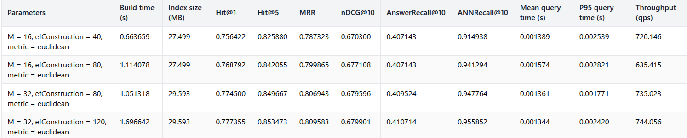

**Table 1.7.** HNSW sensitivity analysis.

LSH remains the weakest option in this updated comparison. Its best setting in the notebook is ``nbits = 256``, but even there the retrieval quality is noticeably lower: ``Hit@1 = 0.740247``, ``Hit@5 = 0.839201``, ``MRR = 0.783001``, ``nDCG@10 = 0.624716``, and ``AnswerRecall@10 = 0.391667``. Its ANN fidelity is also much lower than HNSW, with ``ANNRecall@10 = 0.518363``. LSH is very compact, with an index size below 1 MB, but that compactness does not translate into a compelling speed advantage here: mean query time is 0.010490 seconds, p95 query time is 0.019492 seconds, and throughput is only about 95.33 queries per second, making it slower than both brute force and HNSW.

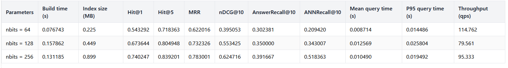

**Table 1.8.** LSH sensitivity analysis.

In general, Brute Force remains the strongest absolute baseline and is a defensible choice because the selected chunking setup yields a corpus of only 17161 chunks, so exact search is not operationally prohibitive here. HNSW, however, offers the best quality-efficiency tradeoff: it preserves most of the retrieval quality of brute force while cutting both average and tail latency substantially and more than doubling throughput. LSH does not justify itself on this corpus, because it loses too much retrieval fidelity and is not faster in practice despite its small memory footprint. Our analysis supports two slightly different conclusions depending on the goal of later stages: if the priority is a clean quality reference, Brute Force should be carried forward; if the priority is a more deployment-minded first-stage retriever, HNSW is the better choice. 

### Conclusion

This section has established the retrieval-side architecture for the TextWave system. The results show that sentence-based chunking is preferable to the fixed-length family overall, but they also show that chunking should not be chosen from article-level early-ranking metrics alone. The 1-sentence, no-overlap configuration is the sharpest setting for surfacing the correct source article very early, but it is not the best overall choice for a downstream RAG pipeline because it retrieves answer-bearing context less reliably. As chunk size increases, answer-bearing retrieval improves, while very early ranking gradually weakens. Sentence chunking with 3 sentences and overlap 1 provides the best compromise across the reported metrics: it preserves strong article-level retrieval, achieves the strongest overall top-10 ordering in the sentence family, substantially improves answer-bearing recall relative to the 1-sentence baseline, and remains operationally efficient in terms of latency.

At the indexing stage, Brute Force provides the strongest absolute retrieval quality and remains entirely feasible at the current corpus scale, so it is the cleanest quality reference. HNSW is only slightly weaker in retrieval quality while being substantially faster at query time, which makes it the best practical quality-efficiency tradeoff. LSH is clearly the weakest option: even at its best setting, it loses too much retrieval fidelity and does not offer a compelling speed advantage on this corpus, despite its small index size.

Taken together, the retrieval analysis supports the following design judgment. The configuration that should be carried forward as the preferred retrieval setup is sentence chunking with 3 sentences and overlap 1. For the index, the choice depends on the role of the pipeline in later experiments. If the goal is to preserve the strongest retrieval reference, Brute Force with euclidean metric is the right backend. If the goal is a more practical architecture with a better speed-quality balance, HNSW is the better choice. In the remainder of the report, we adopt HNSW because it is the more scalable option while preserving retrieval quality close to the exact-search baseline.

## 2. Generative Model Performance Comparison

The second design question in the TextWave case study concerns the generation side of the system, before any retrieval is introduced. Section 1 established which retrieval configurations appear most promising, but that does not yet tell us how much value retrieval may add to answer generation. To answer that broader question, we first need a clean no-RAG baseline: how well can the available language models answer the evaluation questions when they receive only the question itself and no retrieved corpus context?

This section evaluates the stand-alone generative baseline for our RAG system. Notebook ``task2`` compares two Ollama models, `phi3:mini` and `qwen2.5:1.5b`, under a no-context setup, because our purpose is to measure the stand-alone capability of the generators before any retrieval is introduced. Recall that context is the text returned by the retrieval stage and passed to the generator as supporting evidence; since here our aim is to study generator performance without retrieval augmentation, context should be removed. This constitutes a control experiment: if later retrieval-augmented systems outperform this baseline, we can attribute that gain to the interaction between retrieval and generation rather than to generator choice alone. We adapted the original `QAGeneratorMistral` class to an OpenAI-compatible `QAGeneratorOpenAI` implementation for local Ollama inference. The main conceptual change is that, although the class preserves the same generator role and a broadly similar interface, it is modified by removing contextual input from the final generation call. In the original Mistral version, the prompt explicitly combined the question with retrieved context and instructed the model to answer only from that evidence; since we have removed context here, in our adapted version the generator receives only the question, along with a simpler system instruction to produce clear and concise full-sentence answers. Both models are evaluated on the same question set, which contains 1051 questions in total, and the notebook reports results both overall and by difficulty level.

The main evaluation metrics are ``Exact Match`` and ``Transformer Match``, provided by the project's ``Matching`` evaluator. As explained in the introduction, Exact Match measures whether the generated answer matches the expected answer (in a normalized form). Transformer Match is more flexible and better suited to free-form generation, because it can recognize semantically correct paraphrases even when the wording differs from the reference answer. Exact Match prevents us from overstating performance through semantic similarity alone, while Transformer Match avoids penalizing every valid paraphrase as an error.

### Overall model comparison

The overall comparison shows that `qwen2.5:1.5b` is the stronger stand-alone model (see Table 2.1 and Figure 2.1). Across all 1051 questions, `phi3:mini` reaches `Exact Match = 0.284491` and `Transformer Match = 0.302569`, with mean latency `8.797814` seconds per question. `qwen2.5:1.5b` improves these figures to `Exact Match = 0.297812` and `Transformer Match = 0.327307`, while also reducing mean latency to `5.588424` seconds per question. Thus, `qwen2.5:1.5b` is not only more accurate overall, but also noticeably faster. The comparison of total run times reinforces the same point: `phi3:mini` required about 251.3 minutes to process the full benchmark, whereas `qwen2.5:1.5b` completed it in about 185.9 minutes. These totals depend on the local environment, so they should not be read as portable production estimates, but they do support the same practical conclusion as the mean latency summary.

At the same time, the absolute level of performance remains modest for both models. Even the stronger `qwen2.5:1.5b` model answers correctly under Exact Match on less than 30 percent of the full question set, and its Transformer Match score remains below one third. This is a useful finding in itself, suggesting that the TextWave question set contains a substantial amount of information that the stand-alone models cannot answer reliably from pretraining alone, which strengthens the motivation for retrieval augmentation that we will implement in the subsequent tasks.

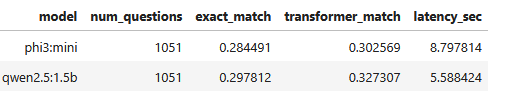

**Table 2.1.** Overall generation baseline performance by model.

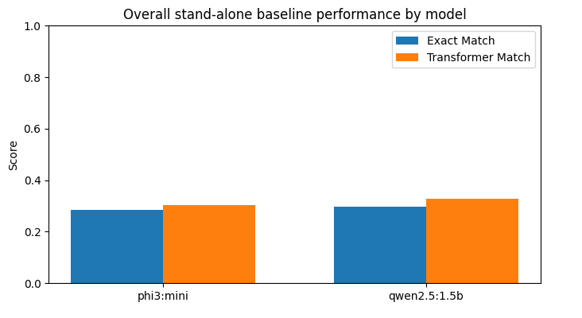

**Figure 2.1.** Overall generation baseline comparison. 

### Difficulty-stratified results

As a supplementary analysis, we also investigated results by question difficulty. This gives a clearer view of where stand-alone generation tends to break down. The categories provided in the data are ``easy``, ``medium``, ``hard``, ``too easy`` and ``too hard``, as well as some questions for which no difficulty label is provided at all.

The difficulty-stratified results, shown on Table 2.2 and Figure 2.2, preserve the same model ranking observed overall. On `easy` questions, `phi3:mini` achieves `Exact Match = 0.559006` and `Transformer Match = 0.568323`, whereas `qwen2.5:1.5b` reaches `0.571429` and `0.602484`. On `medium` questions, `phi3:mini` reaches `0.220395` and `0.269737`, while `qwen2.5:1.5b` reaches `0.226974` and `0.282895`. On `hard` questions, `phi3:mini` reaches `0.244565` and `0.244565`, while `qwen2.5:1.5b` reaches `0.260870` and `0.282609`. Thus, `qwen2.5:1.5b` is stronger not only overall but on each of the three main difficulty levels individually. It is also faster on every one of those subsets: roughly `5.59` seconds on easy, `5.62` on medium, and `6.15` on hard, compared with approximately `8.70`, `8.77`, and `9.48` seconds for `phi3:mini`.

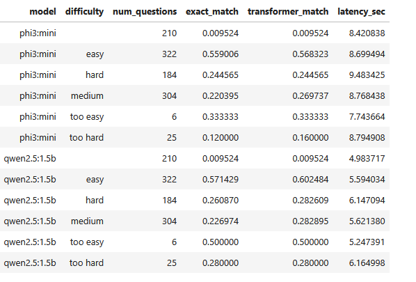

**Table 2.2.** Difficulty-stratified generation baseline performance.

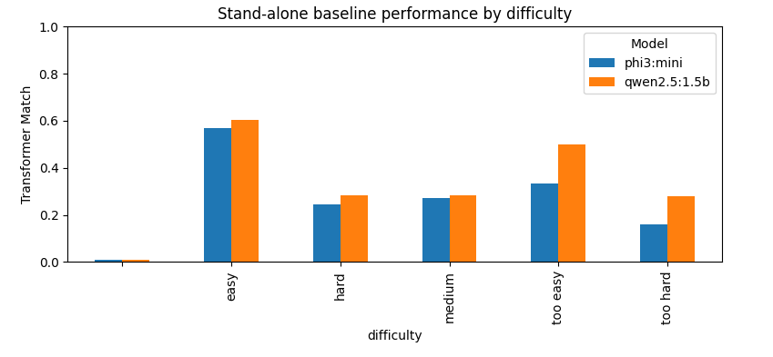

**Figure 2.2.** Difficulty-stratified generation baseline comparison. 

The broader pattern is also clear. Both models perform far better on easy questions than on medium or hard questions. This  tells us where stand-alone generation is already reasonably competent and where retrieval support is most likely to help. On easy questions, both models can often answer correctly from prior knowledge alone, though even there the accuracy is far from perfect. On medium and hard questions, performance drops sharply. The decline is particularly visible in Exact Match, but it is also present under the Transformer Match metric. The smaller categories ``too easy`` and ``too hard`` point in the same general direction, but they should be interpreted cautiously because they contain very few questions. The ``too easy`` subset is tiny and gives somewhat unstable estimates. The ``too hard`` subset is more informative: both models perform very poorly there, which reinforces the conclusion that stand-alone generation becomes especially unreliable at the highest difficulty levels. In practical terms, this means that stand-alone generation is most suitable for direct, well-known, or weakly ambiguous questions, but much less reliable for the more demanding parts of the benchmark.

This difficulty pattern supports an important interpretation for the later RAG analysis. Retrieval augmentation should not be expected to add equal value everywhere. Its most important contribution should appear on the medium and hard subsets, where the no-context baseline is weakest. If later RAG systems improve only on the easy subset, that would be less persuasive evidence of a genuinely useful retrieval pipeline. The more meaningful test is whether retrieved context helps the system close the clear performance gap on the more difficult questions.

### Methodological interpretation and limitations

Our experiment design is methodologically appropriate because it isolates generator behavior from the rest of the RAG pipeline. No chunking, indexing, retrieval, or reranking is used here: we are implementing a baseline for the generation task, to be complemented with retrieval later. The use of the same question set, the same local backend style, and the same scoring procedure for both Ollama generators makes the comparison fair.

At the same time, several limitations should be acknowledged. First, this section does not tell us whether a model's failure comes from lack of knowledge, reasoning weakness, or answer formatting issues: all three are mixed together in the final scores. Second, latency values are hardware and environment-dependent because the models are run through local Ollama rather than a hosted API, so the absolute timings should be interpreted as local operational measurements rather than universal model properties. Finally, the difficulty-stratified interpretation should focus mainly on the easy, medium, and hard categories, since the ``too easy`` and ``too hard`` groups are much smaller and therefore provide less stable estimates.

### Conclusion

In this section we have established the no-RAG generation baseline for TextWave. Our analysis leads to a clear model recommendation: `qwen2.5:1.5b` is the preferred stand-alone generator. It outperforms `phi3:mini` overall on both Exact Match and Transformer Match, it remains stronger on easy, medium, and hard questions individually, and it is substantially faster in the local Ollama setting. The evidence therefore supports carrying `qwen2.5:1.5b` forward as the preferred stand-alone baseline model for later comparisons.

## 3. Retrieval-Augmented Generative Model Performance Comparison

This section addresses the first end-to-end architecture design aspect in the project: once the retrieval backbone has been fixed, how much does retrieval-augmented generation improve answer quality relative to the stand-alone baseline, and which generator is the stronger choice before reranking is introduced?

The purpose of this task is different from what we studied previously. Section 1 isolated the retrieval side of the pipeline and selected a balanced first-stage retrieval design. Section 2 measured the performance of the two Ollama models without any access to retrieved evidence, so it served as a clean stand-alone baseline for generation alone. Now we combine these two components into a single no-reranker RAG pipeline: it constitutes a natural baseline for later comparison with reranker experiments.

### Methodology

The ``task3`` notebook fixes the retrieval architecture in advance and varies only the generator model. We use the strategy selected in Section 1: sentence chunking with 3 sentences and overlap 1, an HNSW first-stage retriever with ``M = 32``, ``efConstruction = 120`` and Euclidean distance, and no reranker. The two generators compared are ``qwen2.5:1.5b`` and ``phi3:mini``. The evaluation metrics are again Exact Match and Transformer Match, and we computed both overall and difficulty-stratified performance for easy, medium, and hard questions. We also fixed the retrieval budget at top-5 (meaning that, for each question, the retriever returns the five highest-ranked chunks and those five chunks are passed to the generator as context), so the architectural comparison is controlled: the retrieval backbone and prompt design remain fixed, and only the generator changes. This allows us to attribute performance differences to the generators themselves, rather than to changes in retrieval quality, context budget, or prompt construction.

The evaluation subset is a cleaned version of ``question.tsv``: we kept only rows that have a valid question, a gold answer, and a source article identifier, because all three are required for retrieval and answer scoring. In the exported run this leaves 838 questions in total, with 322 easy questions, 304 medium questions, 181 hard questions, 25 questions labeled ``too hard``, and 6 labeled ``too easy``. This cleaning step is relevant here because the present task requires both retrieval and generation, whereas the generator baseline in Section 2 could be evaluated on the raw, larger question file because the model was asked to answer from the question alone, so missing article identifiers did not compromise the evaluation.

### Results and interpretation

We have run a no-reranker RAG pipeline comparison for both generators ``qwen2.5:1.5b`` and ``phi3:mini`` on the same cleaned 838-question evaluation set, reporting again the overall and difficulty-stratified summaries (see Table 3.1. and Figure 3.1). Under our fixed architecture, ``qwen2.5:1.5b`` is again the stronger generator overall. On the 838-question cleaned set, it reaches ``Exact Match = 0.585919`` and ``Transformer Match = 0.674224``, compared with ``phi3:mini`` at ``Exact Match = 0.529833`` and ``Transformer Match = 0.600239``. The gain over the no-context baseline is substantial. In Section 2, ``qwen2.5:1.5b`` achieved ``Exact Match = 0.297812`` and ``Transformer Match = 0.327307`` on the 1051-question stand-alone evaluation, while ``phi3:mini`` achieved ``0.284491`` and ``0.302569`` respectively. The main architectural effect is therefore clear: once the generators are supplied with retrieved article evidence, answer quality increases dramatically for both models.

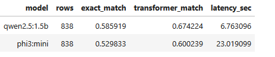

**Table 3.1.** . Overall no-reranker RAG performance by generator.

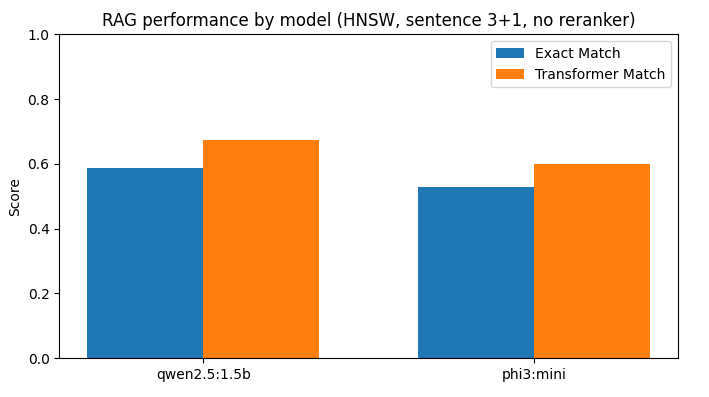

**Figure 3.1.** . Overall no-reranker RAG comparison across generators.

The difficulty-stratified results, shown in Table 3.2, indicate that these gains are not confined to easy questions. For ``phi3:mini``, the no-reranker RAG scores are 0.649068 (Exact Match)/0.673913 (Transformer Match) on easy questions, 0.529605/0.628289 on medium questions, 0.375691/0.486188 on hard questions, 0.500000/0.500000 on too easy questions, and 0.120000/0.160000 on too hard questions. For ``qwen2.5:1.5b``, the corresponding values are 0.763975/0.801242, 0.552632/0.664474, 0.364641/0.508287, 0.500000/0.500000, and 0.320000/0.400000. The highest-difficulty questions `` too hard`` remain the weakest part of the benchmark, while the tiny ``too easy`` subset does not change the overall interpretation. The pattern suggests that retrieval augmentation tends to become most valuable as questions get harder and require more specific grounding than the generators can provide on their own.

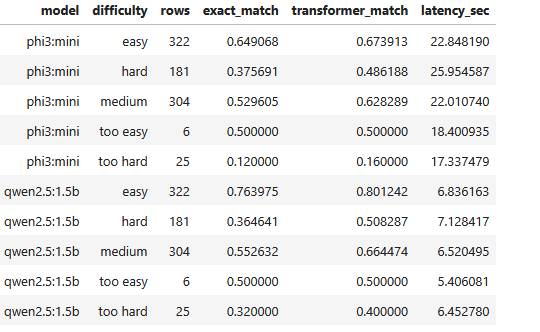

**Table 3.2.** No-reranker RAG performance by generator, stratified by difficulty.

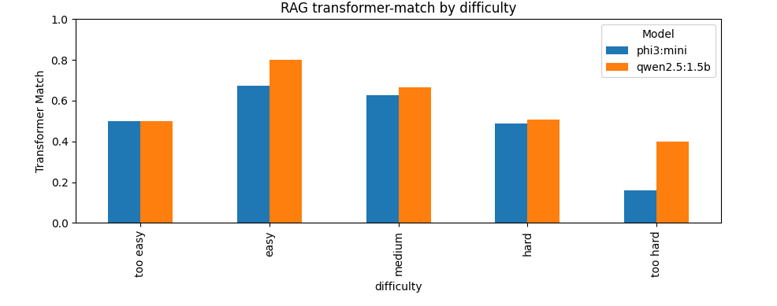

**Figure 3.2.** Generator comparison under the no-reranker RAG architecture, stratified by difficulty

The runtime trade-off is also favorable for ``qwen`` model: it averages 6.763096 seconds per question, whereas ``phi3:mini`` averages 23.019099 seconds under the same retrieval setup. This means ``qwen`` is not only more accurate in the no-reranker RAG setting, but also much faster, similarly to what we found in Section 2. 

At a conceptual level, the large jump in performance from Section 2 to Section 3 indicates that the inclusion of retrieved evidence in the generator pipeline constitutes a clear improvement over a stand-alone generator baseline. 

### Conclusion

We have shown that retrieval augmentation is a key transition point in the TextWave system design. Once the stand-alone generators from Section 2 are placed inside the (no-reranker) RAG pipeline built on the retrieval backbone selected in Section 1, answer quality improves dramatically for both models. This indicates that the main weakness of the stand-alone baselines was not simply limited model capacity, but the lack of access to task-relevant evidence at inference time. On the cleaned 838-question evaluation set, ``qwen2.5:1.5b`` is still the stronger model overall, reaching ``0.585919 Exact Match`` and ``0.674224 Transformer Match`` and a much faster execution, averaging ``6.763096 seconds`` per question versus the ``23.019099`` of ``phi3:mini``.

The difficulty analysis further strengthens this conclusion. The gains are not limited to easy questions: they are even more substantial on medium and hard questions. This is important because it suggests that retrieval is especially valuable when questions require more specific grounding and cannot be answered reliably from the generators' internal knowledge alone.

## 4. Reranker Performance Comparison

In a retrieval-augmented generation pipeline, the retriever scans the indexed document collection by comparing the question embedding with the chunk embeddings in a shared vector space and selects the chunks whose vectors are closest to the question (under the retrieval backend's ranking rule: in our case, Brute Force with euclidean distance, HNSW with euclidean distance, and LSH). This first stage is designed for efficiency and broad coverage: its purpose is to avoid missing useful evidence and to reduce a very large search space to a manageable candidate pool. But this first ranking step does not guarantee that the most informative chunks will be retained at the very top of the returned list. In other words, the generator does not read everything the retriever finds: it only receives a limited number of top-ranked chunks as context. A system may retrieve relevant evidence somewhere in the candidate set, yet still perform poorly if that evidence is ranked below the top-k chunks and therefore never reaches the model. For end-to-end question answering, what matters is not only whether the right information is recovered, but whether it is placed high enough in the final ranking to enter the generator's context window.

This is the motivation for introducing reranking: a second-stage ranking procedure applied to the candidate set returned by the first-stage retriever. Given a query and an initial retrieved set of candidate chunks ``C = {c1, ..., cn}``, a reranker assigns a new relevance score to each candidate conditioned on the query and produces a reordered list of the same candidates. Its role is therefore not to search the whole collection again, but to refine the importance ordering of an already retrieved subset, so the chunks most useful for answering the question are the ones that survive into the model's limited context budget.

In this Section we investigate which reranking strategy should be added to the retrieval-augmented pipeline selected in the previous tasks. The purpose of this analysis is to isolate the effect of reranking after the backbone has already been fixed. Based on our previous results, we select ``qwen2.5:1.5b`` as the preferred generator and do not rerun the weaker ``phi3:mini`` model. Our notebook ``task4`` therefore reuses the retrieval configuration carried forward from the previous section: sentence-based chunking with 3 sentences and overlap 1, and HNSW as the first-stage retriever with ``M = 32``, ``efConstruction = 120``, and Euclidean distance. It also keeps the same answer-scoring framework from earlier tasks, using Exact Match and Transformer Match so that every reranker is evaluated under the same prompt and dataset subset. We consider in our experiment five reranker variants: 

* ``tfidf``: a sparse lexical reranker based on term-frequency and inverse-document-frequency weighting. It re-scores the retrieved candidate chunks by how strongly their word content overlaps with the query, giving more weight to informative terms and less weight to very common ones. Conceptually, this reranker favors chunks that share distinctive query vocabulary.
* ``bow``: a bag-of-words lexical reranker that compares the query and candidate chunks through simple word-occurrence representations. Unlike TF-IDF, it does not downweight common terms in the same way, so it provides a more basic lexical relevance signal. Its role in the comparison is to show how far a simple word-overlap baseline can go as a reranking method.
* ``cross_encoder``: a neural reranker that evaluates each query-chunk pair jointly rather than encoding query and chunk independently. This allows it to model finer semantic interactions between the question and the candidate text, and it is therefore the most expressive reranker in the set.
* ``hybrid``: a combined reranker that brings together lexical and neural evidence in a single reranking score. Its purpose is to balance the precision of lexical overlap with the broader semantic sensitivity of the cross-encoder, in case each captures a different aspect of relevance.
* ``sequential``: a two-stage reranking strategy in which one reranker first narrows or reorders the candidate pool and a second reranker then refines that ordering further. In our setting, this is intended to combine efficiency and quality by using a cheaper signal earlier and a stronger but more expensive signal later.

For deployment, the relevant question is therefore not simply which reranker is strongest in isolation, but which reranker leads to the best answer quality under a practical quality-latency trade-off.

Additionally, we placed particular emphasis on memory efficiency in our implementation of ``task4`` notebook. The notebook reduces RAM usage in several ways: 

* chunk embeddings are encoded and added to the HNSW index in batches instead of all at once 

* explicitly avoid keeping all chunk embeddings in memory after indexing 

* the HNSW candidate pools are precomputed once per question so the same retrieved set can be reused across rerankers

* reranked chunk ids are saved to disk and reused rather than recomputed and retained in large in-memory structures

* the generated outputs are written incrementally to CSV instead of being accumulated entirely in RAM. 

### Overall comparison across rerankers

The overall results (Table 4.1) show that for ``qwen2.5:1.5b``, the best-performing configuration is sequential reranking, which reaches 0.610979 Exact Match and 0.700477 Transformer Match over the 838 evaluated questions the lexical rerankers perform worse overall, while cross-encoder and hybrid also improve over the no-reranker baseline but by a smaller margin, and the lexical rerankers perform worse than the baseline. This makes sequential the clearest winner on Transformer Match, which is the more appropriate metric for open-ended generative QA.

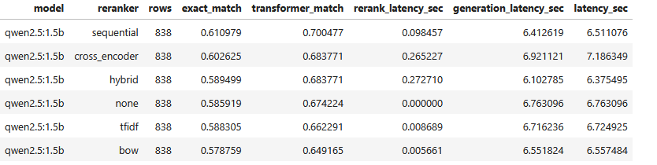

**Table 4.1.** Reranking comparison.

Note that reranking does help the chosen RAG architecture, but only for certain classes of rerankers instead of universally: the no-reranker baseline is already strong, and some rerankers produce worse results than the baseline. Concretely, lexical reranking is not enough for this task: both ``tfidf`` and ``bow`` are fast, but they do not exploit semantic similarity as effectively as the stronger neural methods. In particular, ``bow`` falls below the no-reranker baseline on both Exact Match and Transformer Match, which indicates that a weak reranking stage can actively distort the retrieved evidence rather than refine it.

### Quality-latency trade-off

Latency also supports having chosen sequential reranker as our best reranking strategy. In Table 4.1, we observe that sequential reranking adds only about 0.098 seconds of reranking time per question with respec to the no-reranker baseline, and reaches a total latency of about 6.51 seconds. By contrast, cross-encoder reranking adds about 0.265 seconds of reranking time and increases total latency to about 7.19 seconds, while hybrid reranking has similar reranking overhead at about 0.273 seconds, even though its total latency remains somewhat lower at about 6.38 seconds. The lexical rerankers are cheaper, with reranking latencies below 0.01 seconds, but their answer quality is weaker.

This quality-latency comparison is central to the architectural decision. For instance, if cross-encoder had delivered a decisive gain over sequential, its extra latency might have been justified. But sequential reranking not only outperforms cross-encoder on the main answer-quality metrics, it does so while being substantially cheaper. Hybrid is fast relative to cross-encoder and matches it on Transformer Match, but it still does not surpass sequential in overall quality. Therefore, sequential reranking offers the best balance: it produces the strongest observed answers while keeping the reranking overhead small enough that total runtime remains close to the no-reranker baseline.

### Difficulty-stratified behavior

The difficulty-stratified results still explain why sequential reranking wins overall. On the easy and medium subsets, ``sequential`` provides the largest improvement over the no-reranker baseline, while on hard questions it leaves performance unchanged. This remains the main reason it is the best overall reranker, since these three categories make up almost all of the evaluated set. However, that the benefit is not universal: ``sequential`` improves the small ``too easy`` subset, but it does not improve the ``too hard`` subset, where it falls below the baseline. The broader conclusion is therefore that sequential reranking is the strongest overall choice because it helps most on the larger classes of the dataset (not because it maximizes performance on every difficulty slice). The following table summarizes these findings.

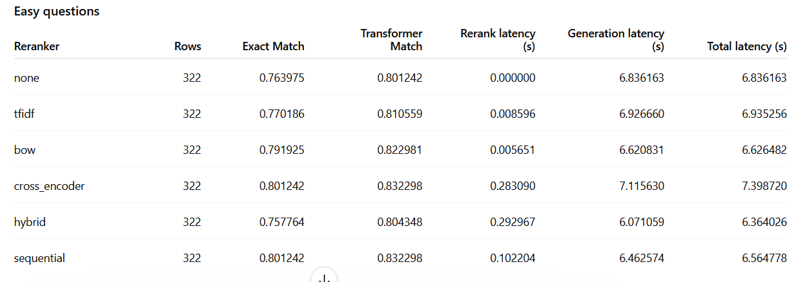

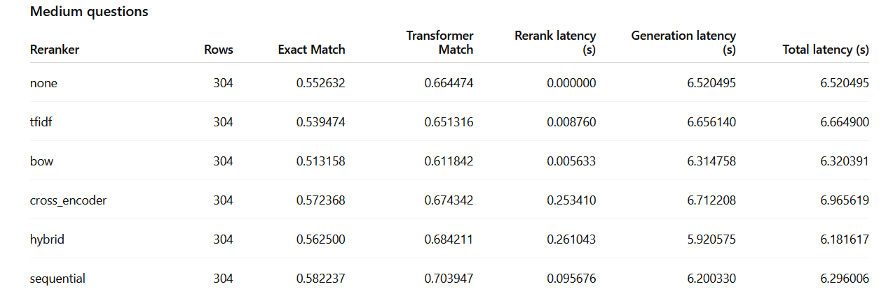

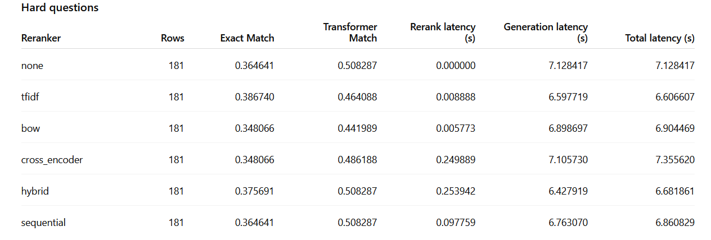

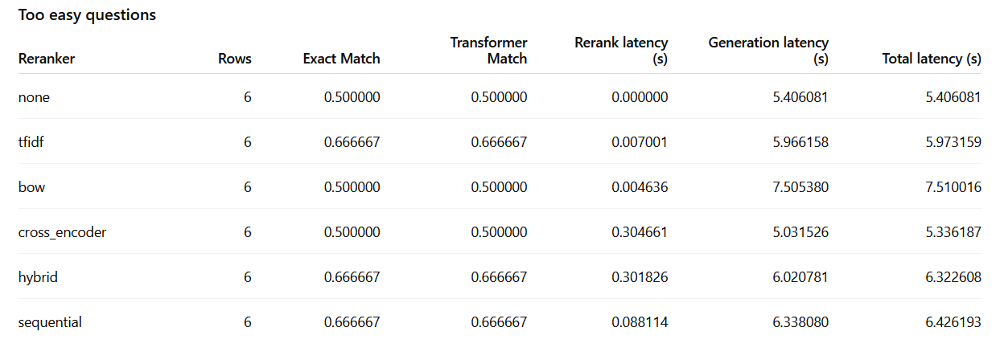

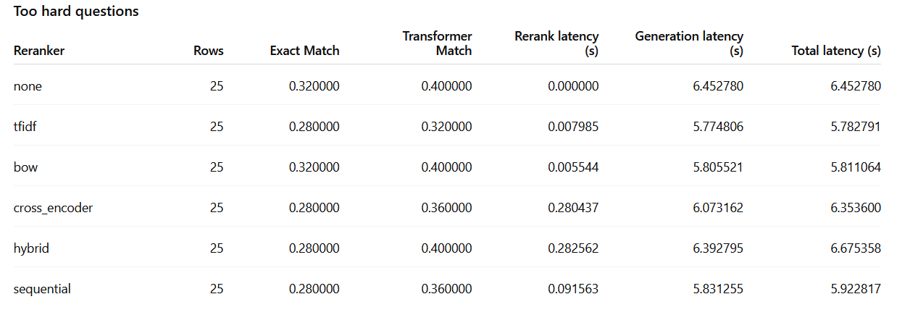

**Table 4.2.** Reranking comparison stratified by difficulty.

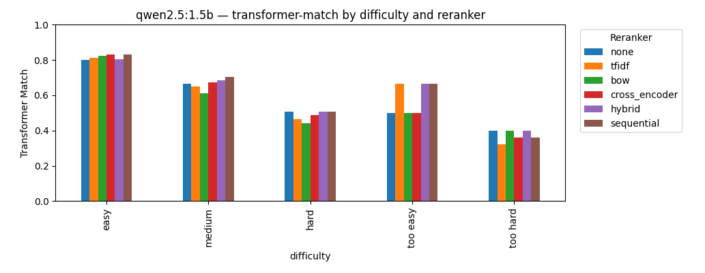

**Figure 4.1.** Visualization of difficulty-stratified reranking comparison.

From difficulty-stratified analysis, reranking appears to help most when useful evidence is already present in the retrieved candidate pool but the initial ranking has not yet placed the most useful chunks high enough for generation. In our setup, sequential reranking is maximizing this effect. On ``hard`` and ``too hard`` questions, however, the main bottleneck appears not to be evidence ordering primarily, but relevant evidence being still be incomplete, the reasoning demand being higher, or the question remaining difficult even after retrieval. Since reranking cannot create new information, its impact is limited in those cases.

The other rerankers support the same broader conclusion. Cross-encoder and hybrid can also help on easier subsets, but their advantages are less stable and they do not improve the harder questions more than sequential. Lexical rerankers are weaker still, and in some cases make the final context worse rather than better. Taken together, the difficulty analysis strengthens the main conclusion: sequential reranking is not best because it wins on every slice of the dataset, but because it provides the most reliable gains on the difficulty slices where reranking can realistically help, while keeping latency overhead moderate.

### Conclusions

We have identified ``sequential`` as the preferred reranker for the TextWave RAG system. Holding the retrieval backbone fixed, our results show that for the ``qwen2.5:1.5b`` generator, sequential reranking is the strongest observed end-to-end architecture, producing the highest overall scores, improving the no-reranker baseline in Exact Match and Transformer Match, while adding only a small latency overhead from the reranking subroutine. The gains are concentrated mainly in easy and especially medium questions, where better evidence ordering helps the generator use retrieved context more effectively.

The design decision carried forward to the next task is therefore to use ``qwen2.5:1.5b`` as the generator and sequential reranking as the reranking stage, on top of the ``sentence(3,1) + HNSW(M=32, efConstruction=120)`` retrieval backbone.

## 5. Optimize the Number of Retrieved Chunks

The optimal architecture has already been selected: a ``qwen2.5:1.5b`` generator combined with the sequential reranker on top of the HNSW retrieval backbone. In this section we study a narrower design question: how many retrieved chunks should the selected RAG system pass to the generator as final context? Our analysis in this section will focus on tuning this single parameter, denoted by $m$: the number of final reranked chunks passed to the generator as context. The goal is to determine how much context the selected RAG system should actually be provided with at inference time.

### Methodology

The analysis is performed in the notebook ``task5``. We kept the architecture fixed to the best-performing configuration selected earlier (sentence chunking with 3 sentences and overlap 1, HNSW first-stage retrieval with ``M = 32``, ``efConstruction = 120``, Euclidean distance, the sequential reranker, and the ``qwen2.5:1.5b`` generator), and then varied only the number of final reranked chunks shown to the model, over the range ``m = 1, 2, 3, 4, 5, 6, 7, 8``. Evaluation is performed on the same cleaned 838-question benchmark used in the earlier RAG experiments, and the scoring criteria are again Exact Match, Transformer Match, and mean latency.

Note that ``m`` is not the HNSW candidate-pool size, nor the intermediate cutoff used inside sequential reranking. It refers to the top-m final reranked candidates (number of chunks) that survive retrieval and reranking and are finally passed to the language model. The motivation for this experiment is to study the tradeoff between too little context (which may omit needed evidence) and too much context (which may introduce redundancy and/or longer inference time). Namely, we want to find the best quality-latency balance, not simply maximize context size.

### Overall Results

The overall results, summarized in Table 5.1, show a clear non-monotonic pattern. Performance improves substantially when moving from very small context sizes to moderate ones, but then plateaus and begins to soften as more chunks are added. At ``m = 1``, the system reaches ``Exact Match = 0.557279`` and ``Transformer Match = 0.652745``. At ``m = 2``, both metrics improve to ``0.591885`` and ``0.676611`` respectrivdely. The selection rule we are using for picking the optimal value of ``m`` is: choose the value of ``m`` that maximizes Transformer Match; if two settings are close, prefer the one with higher Exact Match; if there is still a tie, prefer the one with lower latency. The best overall setting is then ``m = 3``, which reaches ``Exact Match = 0.621718`` and ``Transformer Match = 0.702864`` with mean latency 5.134621 seconds. The next strongest setting is ``m = 4``, which is slightly higher on Exact Match ``0.622912`` but slightly lower on Transformer Match at ``0.701671`` and clearly slower at ``7.570235 seconds``. Beyond that point, adding more chunks no longer helps in a stable way. Performance begins to level off or decline, while latency continues to increase. This suggests that, once the model has access to a moderate amount of well-ranked context, additional chunks tend to add more noise and delay than provide useful new evidence.

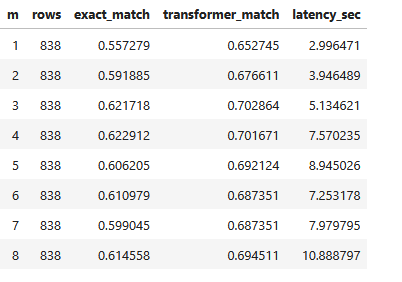

**Table 5.1.** Quality-latency comparison across different values of `m`.

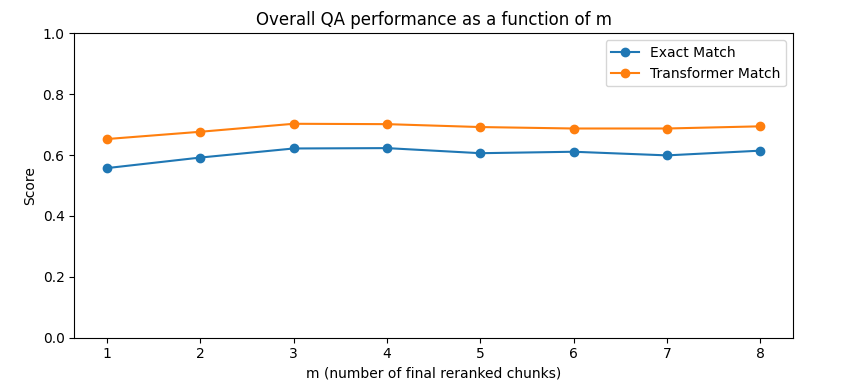

**Figure 5.1.** Overall performance by final context size `m` .

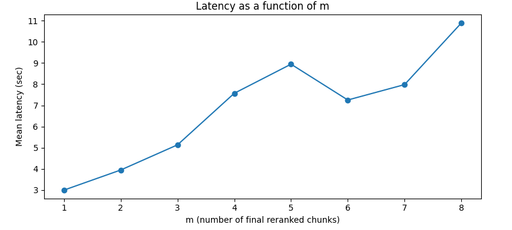

**Figure 5.2.** Latency across different values of `m`.

### Difficulty-Stratified Results

The difficulty-stratified results show that the best value of ``m`` is not identical across question types (see Table 5.2). For easy questions, the strongest setting is ``m = 3``, which reaches ``Exact Match = 0.819876`` and ``Transformer Match = 0.847826``; after that point, performance softens slightly. For medium questions, the best Transformer Match appears at ``m = 4``, which reaches ``0.713816``, with ``m = 3`` and ``m = 5`` remaining close behind. Hard questions behave differently: they continue to benefit from somewhat larger context, with the best Transformer Match appearing at ``m = 7`` and ``m = 8``, both at ``0.513812``, compared with only ``0.408840`` at ``m = 1``.

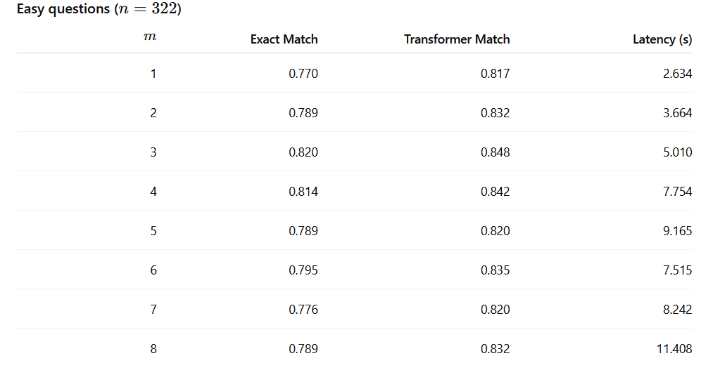

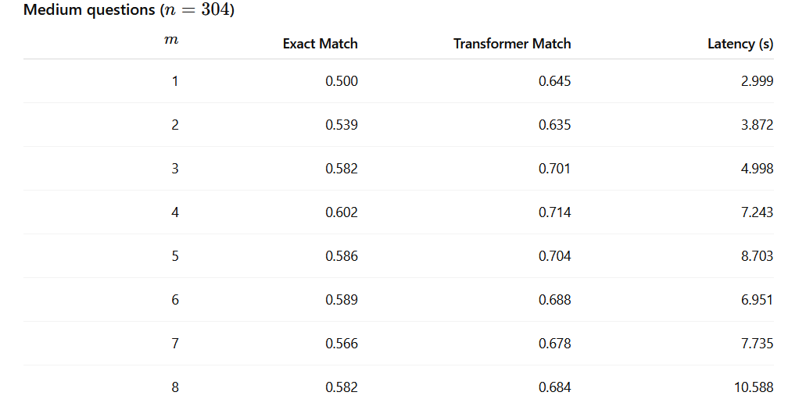

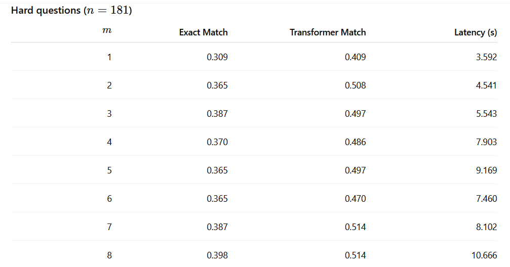

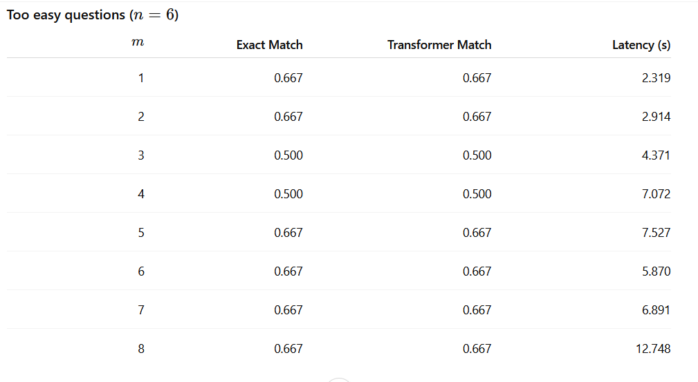

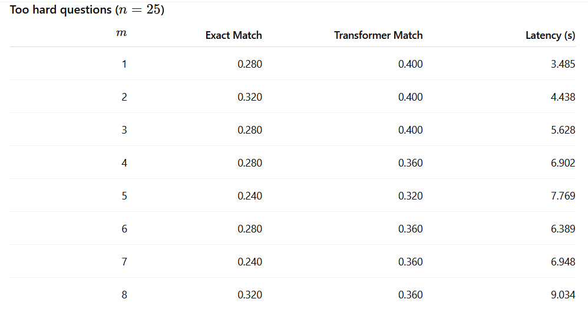

**Table 5.2.** Effect of final context size `m` by question difficulty.

We observe that larger context windows help some of the hardest questions, but those gains are not large enough to overturn the overall recommendation. The evaluated set is dominated by the easy and medium subsets, with 322 easy questions and 304 medium questions, compared with 181 hard questions. As a result, the global optimum is driven mainly by the larger portions of the dataset, where smaller-to-moderate context sizes provide higher scores.

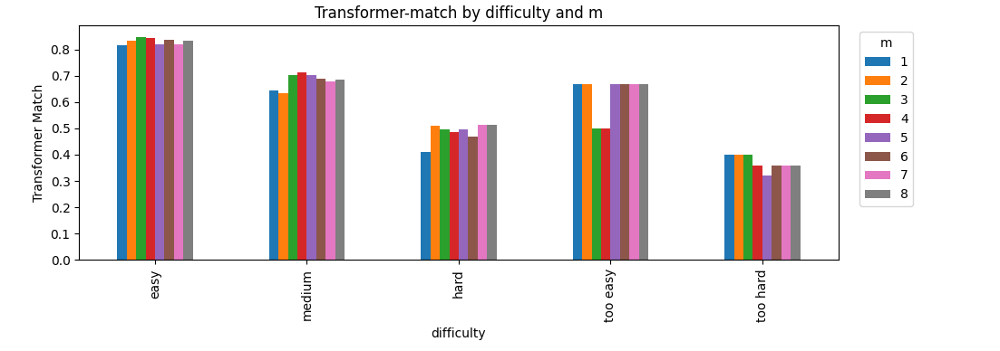

**Figure 5.3.** Visualization of difficulty-stratified performance vs. final context size `m`.

### Conclusions

The main conceptual result is that more context does not automatically lead to a better performance. Once the model has enough evidence to answer most questions, adding extra chunks can begin to dilute the signal rather than strengthen it. In our analysis, performance rises from ``m = 1`` to a moderate peak around ``m = 3`` to ``m = 4``, and then either levels off or declines while latency continues to increase. This is the expected RAG tradeoff: too few chunks can miss useful evidence, but too many can make the final prompt noisier and slower.

Several dataset-specific factors help explain why a relatively small ``m`` works best overall. Many questions are short factual questions, including many yes/no questions, so the answer often depends on a small amount of localized evidence rather than on a long context window. In addition, the system already uses 3-sentence chunking, which makes each chunk fairly information-dense, and overlap 1 means adjacent chunks may partially repeat one another. Those design choices make small and medium values of ``m`` unusually strong, while larger values increasingly risk adding redundancy rather than genuinely new evidence.

Our conclusion is that the optimal value of ``m`` for the selected TextWave RAG architecture is ``m = 3``. This is the setting that maximizes Transformer Match, remains highly competitive on Exact Match, and does so with much lower latency than larger context budgets. 

## 6. Final Recommendation

We recommended for the TextWave RAG system to use sentence-based chunking with 3 sentences and overlap 1, an HNSW retriever with ``M = 32``, ``efConstruction = 120`` and Euclidean distance, a sequential reranker, and the ``qwen2.5:1.5b`` generator, with the top ``m = 3`` reranked chunks passed as final context.

Under this configuration, the system reaches ``Exact Match = 0.621718`` and ``Transformer Match = 0.702864`` at a mean latency of about ``5.13`` seconds per question on the cleaned 838-question evaluation set. This is a substantial improvement over the stand-alone ``qwen2.5:1.5b`` baseline of Section 2 (``Exact Match = 0.297812``, ``Transformer Match = 0.327307``) and over the no-reranker RAG pipeline of Section 3 (``Exact Match = 0.585919``, ``Transformer Match = 0.674224``), confirming that retrieval, reranking, and context sizing each contribute complementary gains.

Several nuances should be kept in mind when interpreting this recommendation. The selected configuration is a balance rather than a dominant winner on every individual metric: 1-sentence chunking is sharper than 3-sentence chunking on early article-level ranking (``Hit@1 = 0.838249`` against ``0.784967``), Brute Force is slightly stronger than HNSW on absolute retrieval quality, and the optimal value of ``m`` is not the same across difficulty levels (``m = 3`` is best on easy questions, ``m = 4`` on medium, but hard questions continue to benefit from larger context, peaking at ``m = 7``/``8``). The global recommendation is therefore driven mainly by the easy and medium subsets, which together dominate the evaluated set. The dataset itself also influences the model choices: many TextWave questions are short factual or yes/no questions whose answers are localized in a small number of sentences, which is part of why a small ``m`` and a moderate-sized chunk are already sufficient and why heavier rerankers such as cross-encoder or hybrid did not pay off relative to the lighter sequential reranker. The choice of Transformer Match as the primary selection metric is important methodologically, because  a system can generate a fully correct answer using wording that differs from the reference answer, and a purely lexical metric would tend to downgrade such cases. Transformer Match is therefore the better primary selection criterion. Exact Match remains valuable as a complementary, stricter check.

The main limitation of this recommendation is that the gains are concentrated on the easy and medium subsets, while the ``too hard`` questions remain weakly answered even under the best architecture. On those questions, the bottleneck appears to be the availability of retrieved evidence rather than its ordering, so further improvements would more likely come from upgrading retrieval or the generator than from additional reranker or context-size tuning. Reported latencies should also be read as local Ollama measurements rather than portable production estimates. The architecture nevertheless remains modular, so individual components can be replaced independently as stronger alternatives become available.

Several directions are worth exploring as future work. The most promising is targeting the ``hard`` and ``too hard`` subsets, where retrieval quality rather than ranking appears to be the bottleneck: this could be addressed through stronger embedding models, query rewriting, or difficulty-adaptive values of `m`. Replacing ``qwen2.5:1.5b`` with a larger generator and rerunning the architectural comparisons would also help separate the contribution of retrieval from the ceiling imposed by generator capacity. Finally, complementing the current article-level relevance evaluation with a stricter answer-span definition would give a more downstream-aligned picture of retrieval quality.